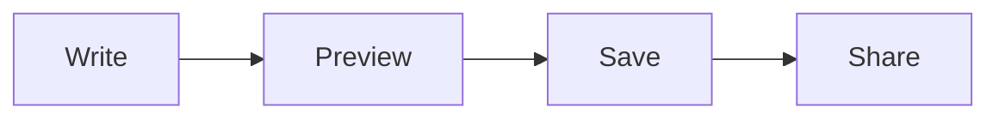

Write Markdown in the split-pane editor with live preview, toolbar formatting and keyboard shortcuts.

The editor shows the Markdown source on the left and a live preview on the right. Use `#` for the page title, then start sections at `##`. The preview scrolls in step with the editor, and the status line shows the word count.

## Markdown basics

Markdown is plain text with a few formatting conventions. You can type these in the editor or use the toolbar; the preview shows the result before you save.

| To write… | Use |
| --- | --- |
| A section heading | `## Plan` |
| A smaller heading | `### Details` |
| Bold or italic text | `**important**` or `*emphasis*` |
| A bullet list | `- First item` on each line |
| A numbered list | `1. First step` on each line |
| An unchecked or completed task | `- [ ] To do` or `- [x] Done` |
| Inline code | Surround text with backticks |
| An external link | `[Example](https://example.com)` |
| A link to another wiki page | `[[Page Title]]` |
| A quoted note | `> A note for readers` |

Leave a blank line between paragraphs. For a block of code, put three backticks on a line before and after it, with a language name after the opening backticks:

````markdown
```sh
printf 'Hello from HMD\n'
```
````

On a saved page, each code block has a **Copy** button that copies the code without extra formatting. This works in the live wiki and static exports. If your browser blocks clipboard access, the button selects the code and asks you to press **Ctrl+C** (**Cmd+C** on macOS).

See [[Links And Navigation]] for page links and [[Attachments]] for uploaded images and files.

## Toolbar

The toolbar row above the editor covers the common actions:


| Control | What it does |
| --- | --- |
| **B**, **I** | Bold and italic |
| **H** | Insert a heading |
| `` `[[link]]` `` | Insert a link: the selected text becomes `[text](url)` Markdown link syntax |
| **code** | Wrap the selection in code |
| **table** | Insert a table |
| **img** | Insert an image placeholder |
| **attach** | Upload an attachment |
| **toc** | Insert a `<!-- hmd:toc -->` token |
| **preview** | Hide the preview pane for more writing space |
| **wrap** | Toggle word wrap |
| **Full**, **Type**, **Focus** | Full-screen manuscript mode, typewriter scroll and focus mode |

## Keyboard shortcuts

| Shortcut | What it does |
| --- | --- |
| `ctrl-s` / `cmd-s` | Save |
| `ctrl-k` / `cmd-k`, or `/` | Open the command palette |
| `ctrl-e` / `cmd-e` | Edit the current page |
| `ctrl-j` / `cmd-j` | New page from the namespace's quick-create template |
| `ctrl-shift-k` / `cmd-shift-k` | Insert a link (`[text](url)`) |
| `ctrl-b` / `cmd-b`, `ctrl-i` / `cmd-i` | Bold, italic |
| `alt-1`, `alt-2`, `alt-3` | Heading levels 1 to 3 |
| `ctrl-shift-f` | Full-screen manuscript mode |
| `ctrl-shift-t` | Typewriter scroll |
| `ctrl-shift-d` | Focus mode |

`ctrl` works on Windows and Linux; `cmd` on macOS.

## Diagrams

Fenced `mermaid` blocks render as diagrams in the preview and on the saved page:

````markdown

````

The resulting diagram:


In the editor, the preview updates while you write:


## Raw HTML

Raw HTML in page bodies is rendered deliberately. A sanitizer strips scripts and event handlers, but the remaining HTML is still trusted content, so only give editing access to users you trust.

## Common pitfalls

- The editor saves drafts locally and restores them if the page changes, but a save is the only thing that writes to the repository.
- The `` `[[link]]` `` button and `ctrl-shift-k` insert a Markdown link (`[text](url)`). For a wiki-link that HMD can track in backlinks, type `[[Title]]` by hand.
- Unsaved changes warn on navigation away from the page.

## Next steps

[[Pages]], [[Attachments]], [[Links And Navigation]].
